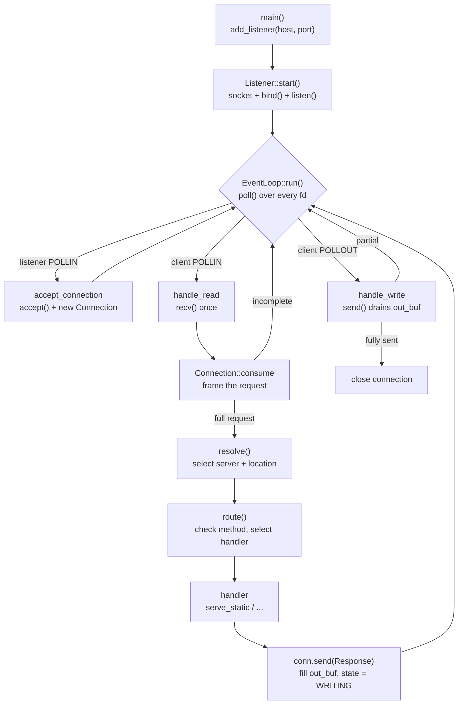

<div align="center">
    <picture>
      <source media="(prefers-color-scheme: dark)" srcset="assets/banner.png">
      
    </picture>

# servant
A HTTP server written in C++.

A single thread serves many clients at once: every socket is non-blocking and
multiplexed through one `poll()` loop. No thread per connection, no blocking I/O.

</div>

---

## Build & run

```sh
make                    # build ./webserv
./webserv               # run with ./default.conf
./webserv my.conf       # run with a specific config file
```

The listen address(es), document root, allowed methods, error pages, etc. all
come from the config file — nothing is hardcoded.

## Lifecycle



A `Connection` is a small state machine driven by `EventLoop`:

```
READING_HEADERS ──► READING_BODY ──► PROCESSING ──► WRITING ──► CLOSING
```

`resolve_poll_event()` maps the current state to the poll flags the loop should
wait on (`POLLIN` while reading, `POLLOUT` while writing, nothing otherwise), so
a connection is only woken when it can make progress.

### Framing

`Connection::consume()` appends received bytes and advances the framing FSM:

- **Headers** — buffered until `\r\n\r\n`. Capped at `MAX_HEADER_SIZE` (8 KB);
  malformed or oversized headers get a `400`.
- **Body** — read up to `Content-Length`, capped at the matched location's
  `client_max_body_size` (from config → `413`). Chunked transfer-encoding is
  currently rejected with `501`.
- Pipelined bytes past the body are kept in the buffer for the next request.

It returns `true` only once a full request is framed and ready to serve.

## Routing

Once framed, `resolve()` selects the `ServerConfig` (by `Host` header among the
listener's virtual hosts) and the longest-prefix `LocationConfig` for the
target. `route()` then enforces the location's allowed methods (`405` with an
`Allow` header), applies any configured redirect, and dispatches to a handler.

## Responses

Responses are built with a small chainable `Response` object and sent through
one choke point, `Connection::send()`:

```cpp
conn.send(Response(200).header("Content-Type", mime).body(content));
conn.send(Response(301).header("Location", target + "/"));
conn.send(Response(404));   // body auto-filled from the location's error_page, or a default
```

`send()` serializes to the wire form (always emitting `Connection: close` and
`Content-Length`) and, for a bodyless error status, serves the configured
custom `error_page` file if one is set, falling back to a built-in page.

## Layout

```
include/            public headers (one per .cpp, -Iinclude)
src/
  main.cpp          boot: load config, then hand off to the EventLoop
  core/             the networking engine — sockets, polling, connections
  http/             the HTTP/1.1 protocol — parse requests, build responses
  handlers/         decide what a request does and produce its response
  config/           turn the config file into the server/location model
  utils/            shared helpers (logging, strings, paths, file reads)
www/                example document root used by default.conf
tools/linux-build/  Docker wrapper to build/test on Linux from macOS
```

## Components

| Component | Responsibility |
|-----------|----------------|
| `EventLoop` | Owns all `Listener`s and `Connection`s. Builds the pollfd set each tick, dispatches readable/writable FDs, accepts new clients, reaps dead ones. Catches `SIGINT`/`SIGTERM` for clean shutdown. |
| `Listener` | A bound, listening socket for one `host:port`. |
| `Connection` | Per-client state: `fd`, in/out buffers, `state`, parsed `Request`, matched server/location. Frames requests via `consume()`, queues output via `send()`. |
| `Request` | Parsed method, target, query, version, lowercased headers, body. |
| `Response` | Chainable response builder (`status`, `.header()`, `.body()`); `serialize()` produces the wire form. |
| `Config` | Parses the config file into `ServerConfig`/`LocationConfig` (root, index, methods, redirects, `client_max_body_size`, `error_page`, autoindex). |
| `Router` | Selects the server (by `Host`) and longest-prefix location, enforces allowed methods, and dispatches to a handler. |
| `StaticFileHandler` | Serves a file under the matched location's `root`, using its `index` for directories, or an autoindex listing. |
| `Logger` / `Utils` | Logging and string/file helpers shared across the codebase. |

## WIP Notes 

- `SIGPIPE` is ignored so a write to a closed socket fails the `send()` instead
  of killing the process.
- `poll()` blocks indefinitely (`-1`); a signal interrupts it (`EINTR`) so the
  loop can recheck the shutdown flag.
- Keep-alive is not yet wired up — every response carries `Connection: close`
  and the connection closes after one response.
- `UploadHandler` and `DeleteHandler` are stubs; only `GET` (static serving) is
  handled so far — other methods get `501`.
- Chunked transfer-encoding is rejected with `501`.
