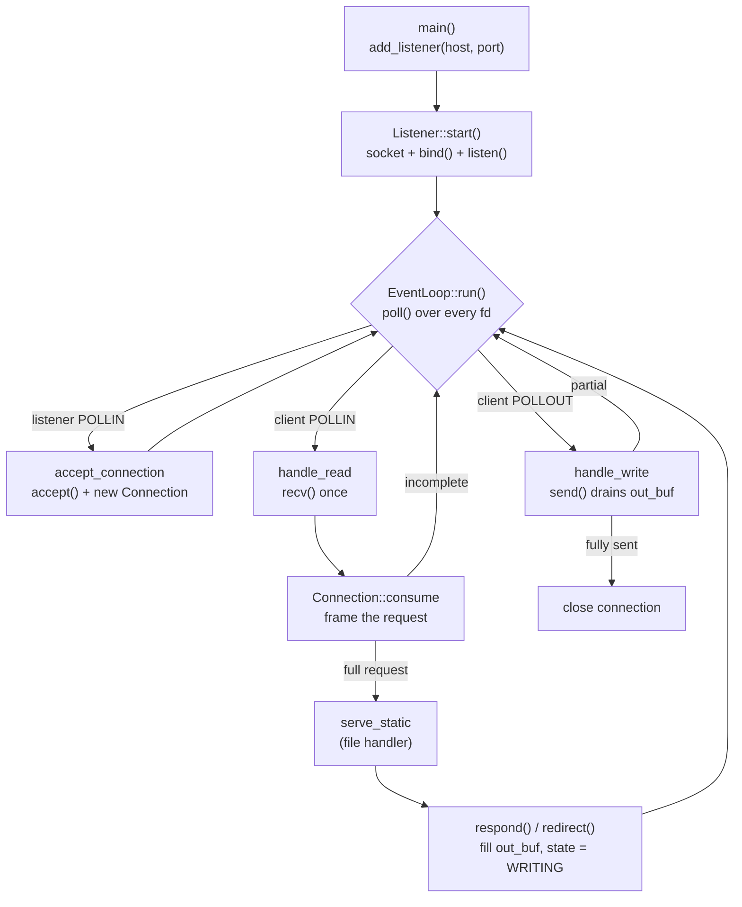

<div align="center">
    <picture>
      <source media="(prefers-color-scheme: dark)" srcset="assets/banner.png">
      
    </picture>

# servant
A HTTP server written in C++.

A single thread serves many clients at once: every socket is non-blocking and
multiplexed through one `poll()` loop. No thread per connection, no blocking I/O.

</div>

---

## Build & run

```sh
make            # build ./webserv
./webserv       # listens on 0.0.0.0:8080, serves files from ./www
```

## Lifecycle



A `Connection` is a small state machine driven by `EventLoop`:

```
READING_HEADERS ──► READING_BODY ──► PROCESSING ──► WRITING ──► CLOSING
```

`resolve_poll_event()` maps the current state to the poll flags the loop should
wait on (`POLLIN` while reading, `POLLOUT` while writing, nothing otherwise), so
a connection is only woken when it can make progress.

### Framing

`Connection::consume()` appends received bytes and advances the framing FSM:

- **Headers** — buffered until `\r\n\r\n`. Capped at `MAX_HEADER_SIZE` (8 KB);
  malformed or oversized headers get a `400`.
- **Body** — read up to `Content-Length`, capped at `MAX_BODY_SIZE` (10 MB →
  `413`). Chunked transfer-encoding is currently rejected with `501`.
- Pipelined bytes past the body are kept in the buffer for the next request.

It returns `true` only once a full request is framed and ready to serve.

## Layout

```
include/            public headers (one per .cpp, -Iinclude)
src/
  main.cpp          entrypoint: ignore SIGPIPE, start EventLoop on :8080
  core/             the networking engine
    EventLoop.cpp     poll() loop, accept/read/write dispatch, signal handling
    Listener.cpp      bind + listen socket per host:port
    Connection.cpp    per-client buffers + request framing FSM
  http/             HTTP/1.1 protocol layer
    Request.cpp       request-line + header parsing
    Response.cpp      response/redirect builders
    Status.cpp        status code -> reason phrase
    Mime.cpp          file extension -> Content-Type
  handlers/         request handlers
    StaticFileHandler.cpp  resolve path under ./www, serve file or index.html
  config/           config parsing (work in progress)
  utils/
    Logger.cpp        leveled logging (LOG_LEVEL compile flag)
    Utils.cpp         Str builder, split/trim, safe_atol, header lookup
www/                document root served by default (.gitignored, you need to create it)
tools/linux-build/  Docker wrapper to build/test on Linux from macOS
```

## Components

| Component | Responsibility |
|-----------|----------------|
| `EventLoop` | Owns all `Listener`s and `Connection`s. Builds the pollfd set each tick, dispatches readable/writable FDs, accepts new clients, reaps dead ones. Catches `SIGINT`/`SIGTERM` for clean shutdown. |
| `Listener` | A bound, listening socket for one `host:port`. |
| `Connection` | Per-client state: `fd`, in/out buffers, `state`, parsed `Request`. Frames requests via `consume()`, queues output via `respond()` / `redirect()`. |
| `Request` | Parsed method, target, query, version, lowercased headers, body. |
| `StaticFileHandler` | Maps `Request` to a file under `ROOT` (`./www`), falling back to `DEFAULT_FILE` (`index.html`) for directories. |
| `Logger` / `Utils` | Logging and string helpers shared across the codebase. |

## WIP Notes 

- `SIGPIPE` is ignored so a write to a closed socket fails the `send()` instead
  of killing the process.
- `poll()` blocks indefinitely (`-1`); a signal interrupts it (`EINTR`) so the
  loop can recheck the shutdown flag.
- Keep-alive is not yet wired up — connections close after one response.
- The `config/` module is scaffolding; the listen address is currently
  hardcoded in `main.cpp`.
