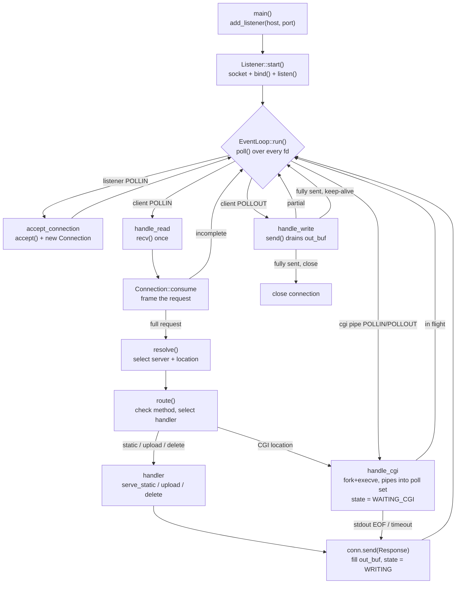

<div align="center">
    <picture>
      <source media="(prefers-color-scheme: dark)" srcset="assets/banner.png">
      
    </picture>

# servant
A HTTP server written in C++.

A single thread serves many clients at once: every socket is non-blocking and
multiplexed through one `poll()` loop. No thread per connection, no blocking I/O.

</div>

```sh
docker run --rm -p 8080:8080 -v /path/to/website:/var/www/html stepskop/servant
```

---

## Build & run locally

```sh
make                             # build ./webserv
./webserv example/servant.conf   # run with the bundled example config
./webserv my.conf                # run with a specific config file
```

The config file is required. The listen address(es), document root, allowed
methods, error pages, etc. all come from it — nothing is hardcoded.

Relative paths are taken from the directory holding the config file, 
the way nginx resolves against its prefix, so a config
behaves the same whatever directory you start the server from. Absolute paths
are used as written.

Two environment variables affect the process itself:

| Variable | Effect |
|----------|--------|
| `LOG_LEVEL` | `debug`, `info`, `warn` or `error`. Overrides the compile-time default; an unrecognized value is ignored. |
| `NO_COLOR` | Set to any non-empty value to drop the ANSI escapes from log output. |

## Docker

servant is published as a base image to extend with your own site — pick a
document root, a config, or both:

```dockerfile
FROM stepskop/servant:latest

COPY site.conf /etc/servant/servant.conf
COPY public/   /var/www/html/
```

A worked example lives in [`example/`](example) — a document root, a config
using every feature, and a Python CGI interpreter layered on top of the base
image. It is self-contained, so the directory is the whole build context:

```sh
cd example
docker build -t servant-example .
docker run --rm -p 8080:8080 servant-example
```

The same config runs without Docker at all:

```sh
./webserv example/servant.conf
```

### Image API

Everything the image guarantees, and all a downstream image needs to touch:

| | |
|---|---|
| Config | `/etc/servant/servant.conf` — [`default.conf`](default.conf), static `GET` only |
| Document root | `/var/www/html` — a placeholder page and a custom 404; replace them |
| Port | `8080`, bound on `0.0.0.0` |
| User | `root`, or `servant` (uid/gid `10001`) on the `-unprivileged` tags |
| Binary | `/usr/local/bin/servant` |
| Entrypoint | `["servant"]`, with the config path as `CMD` |

Both variants listen on 8080, so the port does not change when you switch
between them. Map it on the host if you want 80: `-p 80:8080`. Keep the listen
address at `0.0.0.0` — a published port arrives on the container's own
interface, so a `127.0.0.1` socket is unreachable from outside.

### Which variant

The default tags run as root, which keeps mounted directories writable whatever
the host owns them as. The `-unprivileged` tags run as uid 10001 instead:

```sh
docker run --rm -p 8080:8080 stepskop/servant:1-unprivileged
```

Reach for those when the platform requires it — Kubernetes clusters on the
restricted Pod Security Standard reject root images outright — or simply to
reduce what a bug in the server could reach. The cost is that writable paths
then need to be accessible to uid 10001; see below.

The document root is deliberately not a `VOLUME`, which would shadow files a
downstream image copies underneath it. Uploads are off by default: point
`upload_store` at a directory your image creates and owns.

No CGI interpreter ships in the image. Install the one you need yourself:

```dockerfile
RUN apt-get update \
 && apt-get install -y --no-install-recommends python3 \
 && rm -rf /var/lib/apt/lists/*
```

On an `-unprivileged` base, wrap that in `USER root` … `USER servant`.

### Mounting instead of copying

Baking a site into an image is one option; mounting one at run time is the
other. Both target the same two paths:

```sh
docker run --rm -p 8080:8080 \
  -v "$PWD/public:/var/www/html:ro" \
  -v "$PWD/site.conf:/etc/servant/servant.conf:ro" \
  stepskop/servant
```

Mount the document root read-only and nest a writable mount for uploads, so one
`:ro` does not block the other:

```sh
-v "$PWD/public:/var/www/html:ro" \
-v "$PWD/uploads:/var/www/html/uploads"
```

The upload directory has to exist before the server starts — a missing
`upload_store` answers `404` rather than being created. Uploads also stay off
until a config sets `upload_store`; the shipped one does not.

**Writes and file ownership.** A bind mount carries the host's ownership through
unchanged. Running as root, writes always succeed, but files the server creates
come out owned by root on your host — you will need `sudo` to delete them. On an
`-unprivileged` image the process is uid 10001, so a directory owned by your own
account is readable but not writable and uploads fail. Either option below fixes
that, and both leave written files owned by you rather than root:

```sh
docker run --user "$(id -u):$(id -g)" ...    # run as yourself
sudo chown -R 10001:10001 ./uploads          # or hand the directory over (Linux)
```

Docker Desktop on macOS and Windows fakes ownership in its file-sharing layer,
so writes succeed there whatever the uid — which is why this only surfaces once
you deploy to a Linux host.

**A mount replaces, it does not merge.** Mounting over `/var/www/html` hides the
page and the `errors/404.html` the image ships. If your config keeps
`error_page 404 /errors/404.html` but the mounted directory has no `errors/`,
404s quietly fall back to the built-in page.

**Named volumes are not bind mounts.** `-v sitedata:/var/www/html` copies the
image's document root into the volume the first time it is used, then keeps
serving that copy — so pulling a newer image will *not* change what visitors see.
Bind mounts never do this. Use a bind mount for a site you edit, a named volume
only for data the server writes.

### Tags

Published to both Docker Hub and GHCR, for linux/amd64 and linux/arm64:

```sh
docker pull stepskop/servant
docker pull ghcr.io/stepskop/servant
```

| Tag | |
|-----|--|
| `latest` | the newest Debian release |
| `alpine` | the newest Alpine release |
| `unprivileged` | `latest`, running as uid 10001 |
| `alpine-unprivileged` | `alpine`, running as uid 10001 |

Every release also gets pinnable versions of all four: `1.2.3`, `1.2` and `1`,
each with the same suffix (`1-alpine`, `1-unprivileged`,
`1-alpine-unprivileged`). Pin to `1` for patch and minor updates without a
breaking change, or to an exact version for reproducible builds.

## Lifecycle


```mermaid
flowchart TD
    boot["main()<br/>add_listener(host, port)"] --> listen["Listener::start()<br/>socket + bind() + listen()"]
    listen --> poll

    poll{"EventLoop::run()<br/>poll() over every fd"}

    poll -- "listener POLLIN" --> accept["accept_connection<br/>accept() + new Connection"]
    accept --> poll

    poll -- "client POLLIN" --> read["handle_read<br/>recv() once"]
    poll -- "client POLLOUT" --> write["handle_write<br/>send() drains out_buf"]

    read --> consume["Connection::consume<br/>frame the request"]
    consume -- "incomplete" --> poll
    consume -- "full request" --> resolve["resolve()<br/>select server + location"]
    resolve --> route["route()<br/>check method, select handler"]
    route -- "static / upload / delete" --> serve["handler<br/>serve_static / upload / delete"]
    route -- "CGI location" --> cgi["handle_cgi<br/>fork+execve, pipes into poll set<br/>state = WAITING_CGI"]
    serve --> respond["conn.send(Response)<br/>fill out_buf, state = WRITING"]
    respond --> poll

    poll -- "cgi pipe POLLIN/POLLOUT" --> cgi
    cgi -- "stdout EOF / timeout" --> respond
    cgi -- "in flight" --> poll

    write -- "partial" --> poll
    write -- "fully sent, keep-alive" --> poll
    write -- "fully sent, close" --> close["close connection"]
```

A `Connection` is a small state machine driven by `EventLoop`:
`READING_HEADERS → READING_BODY → WRITING`, with CGI requests detouring through
`WAITING_CGI` before `WRITING`. There is no explicit closing state — a finished
connection is simply destroyed.

`resolve_poll_event()` maps the current state to the poll flags the loop should
wait on (`POLLIN` while reading, `POLLOUT` while writing, nothing otherwise), so
a connection is only woken when it can make progress.

#### Flow of a request
Every request moves through the same phases, one poll event at a time:

1. **Accept** — a new connection is accepted and starts out reading headers.
2. **Read & frame** — incoming bytes are buffered until a complete request
   (headers, then body) is in hand; a partial request just waits for the next read.
3. **Route** — the request is matched to a server and location, its method is
   checked, and it is handed to the handler that owns it (static file, upload,
   delete, or CGI).
4. **Respond** — the handler builds a response, serialized into the connection's
   output buffer.
5. **Write & recycle** — the response is written back; on keep-alive the
   connection resets and waits for the next request, otherwise it closes.

Because `poll()` only wakes a connection for the step it can currently make
progress on, one thread interleaves many requests at once.

### Framing

`Connection::consume()` appends received bytes and advances the framing FSM:

- **Headers** — buffered until `\r\n\r\n`. Capped at `MAX_HEADER_SIZE` (8 KB);
  malformed or oversized headers get a `400`.
- **Body** — read up to `Content-Length`, capped at the matched location's
  `client_max_body_size` (from config → `413`). Chunked transfer-encoding is
  decoded incrementally, enforcing the same size cap.
- Pipelined bytes past the body are kept in the buffer for the next request.

It returns `true` only once a full request is framed and ready to serve.

## Routing

Once framed, `resolve()` selects the `ServerConfig` (by `Host` header among the
listener's virtual hosts) and the longest-prefix `LocationConfig` for the
target (matched on segment boundaries, trailing slash ignored). `route()` then:

1. enforces the location's allowed methods (`405` with an `Allow` header),
2. applies any configured `return` redirect (`301`/`302` with `Location`),
3. if the location has a `cgi_extension` and the target's script segment ends
   with it, dispatches to the CGI handler (see below),
4. otherwise dispatches by method: `GET` → static serving, `POST` → upload,
   `DELETE` → delete. Anything else → `501`.

## CGI

A request matching a CGI location runs a script through its `cgi_interpreter`
via `fork()` + `execve()` without blocking the loop: the child's stdin/stdout
pipes join the poll set, the request body is streamed in and the output read
back until EOF, then the child is finished with `waitpid(WNOHANG)`. Its output is
split at the first blank line — CGI headers (incl. `Status:`/`Location:`) merge
into the response, the rest is the body. A script that overruns its deadline is
killed and answered `504`; other failures map to `404`/`403`/`500`/`502`.

## Responses

Responses are built with a small chainable `Response` object and sent through
one choke point, `Connection::send()`:

```cpp
conn.send(Response(200).header("Content-Type", mime).body(content));
conn.send(Response(301).header("Location", target + "/"));
conn.send(Response(404));   // body auto-filled from the location's error_page, or a default
```

`send()` stamps the `Connection` header (`keep-alive` or `close`), serializes to
the wire form (with the right `Content-Length`), and — for a bodyless error
status — serves the configured custom `error_page` file if one is set, falling
back to a built-in page.

## Layout

```
include/            public headers (one per .cpp, -Iinclude)
src/
  main.cpp          boot: load config, then hand off to the EventLoop
  core/             the networking engine — sockets, polling, connections
  http/             the HTTP/1.1 protocol — parse requests, build responses
  handlers/         decide what a request does and produce its response
  cgi/              fork/execve a CGI script and pump its pipes through poll
  config/           turn the config file into the server/location model
  utils/            shared helpers (logging, strings, paths, file reads)
www/                default document root — shipped in the image, reused by the example
example/            the showcase: every feature turned on, and the image it builds
tools/linux-build/  Docker wrapper to build/test on Linux from macOS
Dockerfile          the published image; Dockerfile.alpine is the musl variant
.github/workflows/  build and smoke-test on every push, publish on a v* tag
```

## Components

| Component | Responsibility |
|-----------|----------------|
| `EventLoop` | Owns all `Listener`s and `Connection`s. Builds the pollfd set each tick, dispatches readable/writable FDs, accepts new clients, cleans up dead ones. Catches `SIGINT`/`SIGTERM` for clean shutdown. |
| `Listener` | A bound, listening socket for one `host:port`. |
| `Connection` | Per-client state: `fd`, in/out buffers, `state`, parsed `Request`, matched server/location. Frames requests via `consume()`, queues output via `send()`. |
| `Request` | Parsed method, target, query, version, lowercased headers, body. |
| `Response` | Chainable response builder (`status`, `.header()`, `.body()`); `serialize()` produces the wire form. |
| `Config` | Parses the config file into `ServerConfig`/`LocationConfig` (root, index, methods, redirects, `client_max_body_size`, `error_page`, autoindex, `cgi_extension`/`cgi_interpreter`) via a three-stage Tokenizer → parser → resolver pipeline. |
| `Router` | Selects the server (by `Host`) and longest-prefix location, enforces allowed methods, applies redirects, detects CGI, and dispatches to a handler. |
| `StaticFileHandler` | Serves a file under the matched location's `root`, using its `index` for directories, or an autoindex listing. |
| `UploadHandler` | Handles `POST` — multipart and raw bodies → `201` with a `Location` for the created resource. |
| `DeleteHandler` | Handles `DELETE` — `204`/`404`/`403`, traversal-guarded. |
| `Cgi` / `CgiProcess` | Launches a CGI child (fork/execve), owns its pipe fds + pid + deadline, and parses its output into a `Response`. Pipes are driven by the poll loop; the child is cleaned up and killed-on-timeout. |
| `Logger` / `Utils` | Logging and string/file helpers shared across the codebase. |
